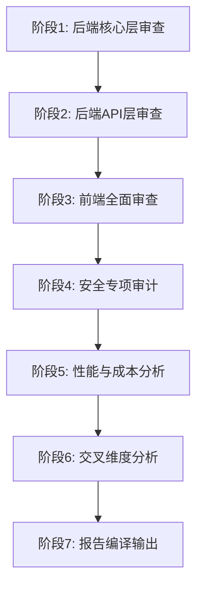

## 用户需求

对 NoEndStory 前后端代码库（后端约95个核心.py文件，前端约23个.ts/.tsx文件）进行全面系统性Review，逐一审查每个工程文件，最终输出综合评估报告（.docx格式）。

## 评估维度

### 系统层面

1. **系统安全性**：认证授权机制、数据保护措施、API安全设计、密钥管理、注入防护、CORS配置
2. **用户体验**：响应速度、错误处理机制、加载状态管理、交互设计合理性、无障碍支持
3. **成本控制与盈利点**：API调用优化策略、缓存机制、资源复用、潜在盈利模式分析

### 架构与技术层面

4. **前后端架构设计合理性**：分层设计、职责分离、模块化程度、SOLID原则遵循度
5. **数据处理机制**：数据流设计、存储策略、数据一致性保障
6. **响应时长**：同步/异步处理模式、并发能力、性能瓶颈定位
7. **前后端数据交互模式**：API设计规范（RESTful）、数据格式统一性、错误码规范
8. **前后端耦合程度**：直接依赖关系、接口契约清晰度、类型共享程度

### Agent专项审查

9. **Agent设计**：验证是否存在多智能体架构及协同逻辑，评估Agent设计是否契合整体架构

## 输出要求

- 逐一审查每个工程文件（不遗漏）
- 每项问题需包含具体文件路径、行号定位、问题描述
- 架构优化建议需附带重构优先级排序（P0/P1/P2）
- 最终报告格式为 .docx 文档，包含完整的评分矩阵和可视化图表

## 审查方法与技术策略

### 审查流程（7阶段流水线）

本次Review采用分模块、分层级的递进式审查策略，确保覆盖所有文件且无遗漏：

### 各阶段审查策略

#### 阶段1-2：后端分层审查

- **审查范围**：backend/ 下所有 .py 文件（game/, llm/, models/, database/, api/）
- **审查方法**：按分层架构自下而上（基础设施层 → 领域层 → 服务层 → API层）
- **重点**：Agent架构设计、LLM适配器模式完整性、数据库连接池配置

#### 阶段3：前端审查

- **审查范围**：frontend/src/ 下所有 .ts/.tsx 文件
- **审查方法**：按数据流方向（types → services → hooks → components → pages）
- **重点**：API层封装质量、状态管理、错误边界、加载状态处理

#### 阶段4：安全专项审计

- 审计清单：密钥暴露风险、SQL/NoSQL注入、XSS、CORS配置、输入验证、错误信息泄露
- 对后端 config.py 和 .env 管理的安全性进行逐项检查

#### 阶段5：性能与成本分析

- 分析LLM API调用频次与token消耗模式
- 评估缓存策略（图片缓存、TTS缓存、向量检索缓存）
- 识别N+1查询、重复计算、无意义重渲染等性能问题

#### 阶段6：交叉维度分析

- 前后端API契约一致性校验（Schema对齐）
- 数据流端到端追踪
- 耦合度量化评估（直接import依赖统计）

### 报告输出

使用 [skill:docx] 生成专业 .docx 报告，包含：

- 执行摘要
- 各维度评分矩阵（1-5分制）
- 问题清单（含路径/行号/严重度/优先级）
- 架构优化建议（含重构路线图）
- 可视化图表（评分雷达图、问题分布饼图）

## Agent Extensions

### Skill

- **docx**
- Purpose：生成最终综合评估报告（.docx格式），包含评分矩阵、问题清单、架构优化建议和重构优先级排序
- Expected outcome：一份结构完整、格式专业的Word文档，包含所有9个维度的评估结果、可视化评分表、具体问题定位（含文件路径和行号）以及分优先级的重构路线图